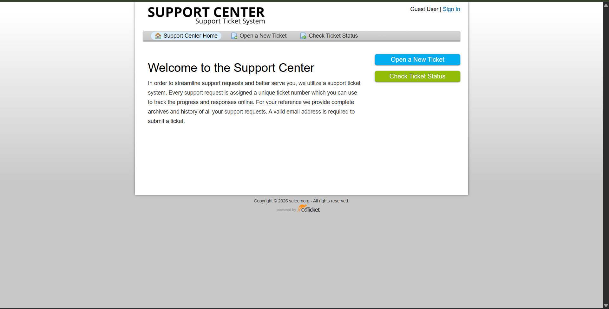
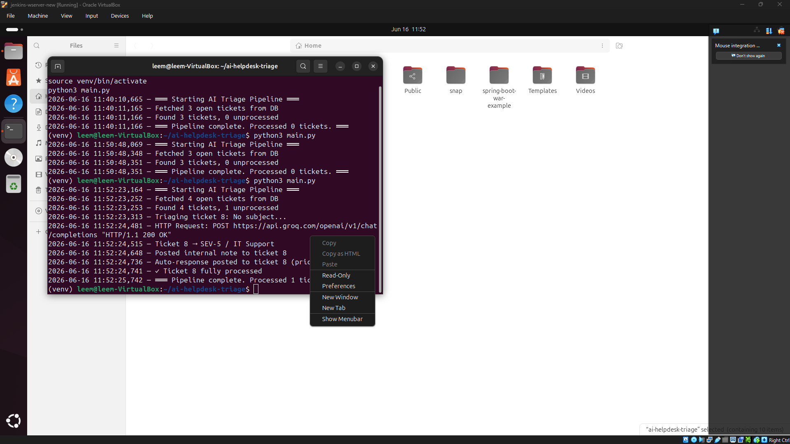
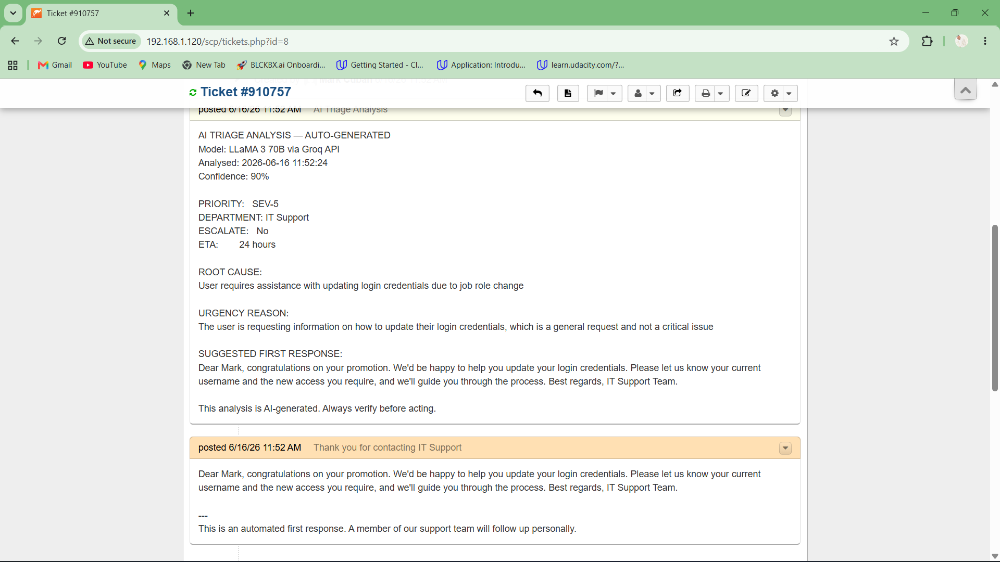
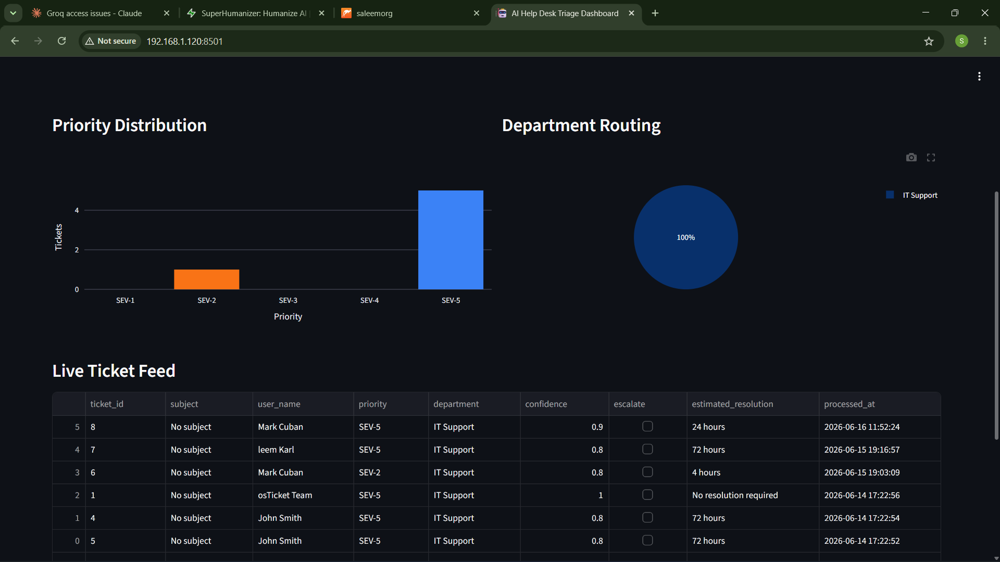

# AI Help Desk Triage Assistant — Full Project Documentation

> **Author:** Saleem Ahmed  
> **Platform:** Ubuntu 24 VirtualBox VM  
> **Stack:** Python 3.12 · osTicket · Groq API (LLaMA 3 70B) · MySQL · Streamlit  
> **Purpose:** Automatically triage incoming IT support tickets using AI, post analysis as internal notes, and send first responses to users.

---

## Table of Contents

1. [Project Overview](#1-project-overview)
2. [Architecture](#2-architecture)
3. [File Structure](#3-file-structure)
4. [Prerequisites](#4-prerequisites)
5. [Setup & Installation — Step by Step](#5-setup--installation--step-by-step)
6. [Errors Encountered & Fixes Applied](#6-errors-encountered--fixes-applied)
7. [osTicket API — Key Findings](#7-osticket-api--key-findings)
8. [How the Pipeline Works](#8-how-the-pipeline-works)
9. [Configuration Reference](#9-configuration-reference)
10. [Running the Project](#10-running-the-project)
11. [Dashboard](#11-dashboard)
12. [Lessons Learned](#12-lessons-learned)

---

## 1. Project Overview

This project implements an AI-powered IT Help Desk Triage Assistant that:

- Connects to an **osTicket** installation and fetches open support tickets
- Sends each ticket to **LLaMA 3 70B** (via Groq API) for intelligent analysis
- Returns a structured triage decision including priority (SEV-1 to SEV-5), department routing, root cause assessment, estimated resolution time, and a draft first response
- Posts the AI analysis as an **internal note** on the ticket
- Sends an **automated first response** to the user for lower-priority tickets (SEV-3 and below)
- Logs all results to a JSON file
- Displays a live **Streamlit dashboard** with charts and ticket feed

The lab originally called for the Groq API to handle AI inference. All other components (osTicket, MySQL, Python) run locally inside a VirtualBox VM.

---

## 2. Architecture

```
┌─────────────────────────────────────────────────────────┐
│                    VirtualBox VM                         │
│                                                         │
│  ┌──────────┐     ┌──────────────┐     ┌────────────┐  │
│  │ main.py  │────▶│ triage_      │────▶│ Groq API   │  │
│  │(pipeline)│     │ engine.py    │     │ LLaMA 3 70B│  │
│  └────┬─────┘     └──────────────┘     └────────────┘  │
│       │                                                  │
│       │           ┌──────────────┐                      │
│       ├──────────▶│ osticket_    │                      │
│       │           │ connector.py │                      │
│       │           │ (MySQL)      │                      │
│       │           └──────┬───────┘                      │
│       │                  │                               │
│       │           ┌──────▼───────┐                      │
│       │           │   MySQL DB   │                      │
│       │           │  (osticket)  │                      │
│       │           └──────────────┘                      │
│       │                                                  │
│       │           ┌──────────────┐                      │
│       ├──────────▶│auto_responder│                      │
│       │           │    .py       │                      │
│       │           └──────────────┘                      │
│       │                                                  │
│       │           ┌──────────────┐                      │
│       └──────────▶│ dashboard.py │                      │
│                   │ (Streamlit)  │                      │
│                   └──────────────┘                      │
└─────────────────────────────────────────────────────────┘
```

**Key design decision:** The osTicket free/open-source API only supports creating tickets via POST. Reading tickets and posting internal notes are not available through the API. These operations are performed by connecting **directly to MySQL**, which is possible since both Python and osTicket run on the same VM.

---

## 3. File Structure

```
ai-helpdesk-triage/
├── main.py                  # Orchestrates the full pipeline
├── triage_engine.py         # Sends tickets to Groq/LLaMA 3 for AI analysis
├── osticket_connector.py    # Reads tickets and posts notes via MySQL
├── auto_responder.py        # Sends AI-generated first responses to users
├── dashboard.py             # Streamlit dashboard for visualising results
├── requirements.txt         # Python dependencies
├── .env                     # Environment variables (not committed to git)
├── .env.example             # Template for environment variables
└── logs/
    ├── triage.log           # Runtime log
    └── triage_results.json  # All triage results in JSON
```

---

## 4. Prerequisites

| Requirement | Version | Notes |
|---|---|---|
| Ubuntu | 24.04 | Running inside VirtualBox |
| Python | 3.12 | Pre-installed on Ubuntu 24 |
| osTicket | 1.18+ | Installed at `/var/www/osticket/upload/` |
| MySQL | 8.0+ | Database: `osticket`, User: `osticket_user` |
| Apache | 2.4 | Serves osTicket at `http://192.168.1.120` |
| Groq API key | Free | From console.groq.com |

---

## 5. Setup & Installation — Step by Step

### Step 1 — Get a Free Groq API Key

1. Go to **console.groq.com** (use a mobile hotspot if your network blocks it — see Error #1)
2. Sign up for a free account — no credit card required
3. Navigate to **API Keys → Create API Key**
4. Copy the key (starts with `gsk_...`)

### Step 2 — Clone or Download the Project Files

Download the project zip and extract it:
```bash
cd ~/Downloads
unzip ai-helpdesk-triage.zip
mv ai-helpdesk-triage ~/
cd ~/ai-helpdesk-triage
```

### Step 3 — Install python3-venv

Ubuntu 24 requires a separate package for virtual environments:
```bash
sudo apt install python3.12-venv -y
```

### Step 4 — Create the Virtual Environment

```bash
python3 -m venv venv
source venv/bin/activate
```

Your prompt will change to show `(venv)` when it's active.

### Step 5 — Install Dependencies

```bash
pip install -r requirements.txt
```

If apt lock blocks this, wait for `unattended-upgrades` to finish:
```bash
sudo systemctl stop unattended-upgrades
pip install -r requirements.txt
sudo systemctl start unattended-upgrades
```

### Step 6 — Configure osTicket API Key

1. Log in to osTicket: `http://192.168.1.120/scp`
2. Go to **Admin Panel → Manage → API Keys**
3. Click **Add New API Key**
4. Set IP Address to your VM's IP (run `hostname -I` to find it)
5. Tick **Can Create Tickets**
6. Click Save and copy the key

> **Important:** The IP address in the API key settings must exactly match the IP your machine uses when making requests. A mismatch causes a 401 error.

### Step 7 — Configure Environment Variables

```bash
cp .env.example .env
nano .env
```

Fill in all values:
```
OSTICKET_URL=http://192.168.1.120
OSTICKET_API_KEY=your_api_key_here
GROQ_API_KEY=gsk_your_groq_key_here
DB_HOST=127.0.0.1
DB_USER=osticket_user
DB_PASS=StrongPass123!
DB_NAME=osticket
```

### Step 8 — Create Logs Directory

```bash
mkdir -p logs
```

### Step 9 — Run the Pipeline

```bash
python3 main.py
```

### Step 10 — Launch the Dashboard

```bash
streamlit run dashboard.py
```

Open `http://localhost:8501` in your browser.

---

## 6. Errors Encountered & Fixes Applied

This section documents every error encountered during setup and the exact fix applied.

---

### Error 1 — Groq API Access Denied (Network Block)

**When:** Trying to sign up at console.groq.com and in the Python script  
**Error message:**
```json
{"error":{"message":"Access denied. Please check your network settings."}}
```

**Cause:** The institutional/lab network was blocking connections to groq.com. This affected both the browser and Python requests.

**Fix:** Connected to a mobile phone hotspot to access console.groq.com and create the API key. The key itself is then used in the `.env` file, so Groq only needs to be reachable when the Python script runs — which works fine on the VM's network since the VM uses NAT through the host.

---

### Error 2 — python3-venv Not Available

**When:** Running `python3 -m venv venv`  
**Error message:**
```
The virtual environment was not created successfully because ensurepip is not
available. On Debian/Ubuntu systems, you need to install the python3-venv
package using the following command.
    apt install python3.12-venv
```

**Cause:** Ubuntu 24 ships Python 3.12 but the `venv` module requires a separately installable package.

**Fix:**
```bash
sudo apt install python3.12-venv -y
rm -rf venv
python3 -m venv venv
source venv/bin/activate
```

---

### Error 3 — No Internet in VM (pip fails)

**When:** Running `pip install -r requirements.txt`  
**Error message:**
```
Failed to establish a new connection: [Errno -3] Temporary failure in name resolution
```

**Cause:** VirtualBox VM network adapter was not configured correctly, giving the VM no route to the internet.

**Fix:**
1. Shut down the VM
2. In VirtualBox: **Settings → Network → Adapter 1**
3. Change "Attached to" to **NAT**
4. Start the VM and verify with `ping google.com`

---

### Error 4 — requirements.txt Not Found

**When:** Running `pip install -r requirements.txt` in the wrong directory  
**Error message:**
```
ERROR: Could not open requirements file: [Errno 2] No such file or directory: 'requirements.txt'
```

**Cause:** The requirements.txt file was not in the current working directory — the terminal was open in a different folder.

**Fix:**
```bash
cd ~/ai-helpdesk-triage
pip install -r requirements.txt
```

Or manually create the file:
```bash
cat > requirements.txt << 'EOF'
groq
requests
python-dotenv
streamlit
pandas
plotly
pymysql
EOF
```

---

### Error 5 — Python Code Typed Directly into Bash Terminal

**When:** Trying to run Python test commands  
**Error message:**
```
bash: syntax error near unexpected token `('
```

**Cause:** Multi-line Python code was pasted directly into the bash shell instead of into a Python interpreter.

**Fix — Option A:** Run Python interactively:
```bash
python3
# then paste code
```

**Fix — Option B:** Save to a file and run it:
```bash
cat > test.py << 'EOF'
import requests
# ... your code here
EOF
python3 test.py
```

---

### Error 6 — osTicket API Returns 400 "URL not supported"

**When:** Testing GET request to `/api/tickets.json`  
**Error message:**
```
400 URL not supported
```

**Cause:** The osTicket free version does not support GET requests on the tickets endpoint. The API only supports POST (creating tickets).

**Fix:** Switched to using POST to test the API connection, and later replaced all GET operations with direct MySQL queries.

---

### Error 7 — osTicket API Returns 401 "Valid API key required"

**When:** Testing POST to create a ticket  
**Error message:**
```
401 Valid API key required
```

**Cause:** The IP address registered in the osTicket API key settings did not match the VM's actual IP address. The key was initially created with `192.168.1.20` but the VM's actual IP was `192.168.1.120`.

**Diagnosis:**
```bash
hostname -I
# Output: 192.168.1.120
```

**Fix:**
1. Go to **Admin Panel → Manage → API Keys**
2. Delete the old key (osTicket does not allow editing the IP of an existing key)
3. Create a new key with the correct IP: `192.168.1.120`
4. Update `OSTICKET_API_KEY` in `.env`

---

### Error 8 — osTicket API Returns 500 "Incomplete client information"

**When:** POST to create a ticket with the correct API key  
**Error message:**
```
500 Unable to create new ticket :user
Incomplete client information
```

**Cause (investigated through multiple steps):**

First, the osTicket source code was located:
```bash
find / -name "class.ticket.php" 2>/dev/null
# Found: /var/www/osticket/upload/include/class.ticket.php
```

The error was traced to line 4230 in `class.ticket.php`. The actual root cause was found by watching the Apache error log in real time:
```bash
sudo tail -f /var/log/apache2/error.log
```

The log showed:
```
sh: 1: /usr/sbin/sendmail: not found
```

osTicket was trying to send an email notification when the ticket was created, but `sendmail` was not installed, causing the entire ticket creation to fail with a 500 error.

**Fix:** Disable email alerts and auto-responses in the API request:
```python
payload = {
    'name':        'Test User',
    'email':       'test@test.com',
    'subject':     'API Test',
    'message':     'Testing API connection',
    'source':      'API',
    'alert':       False,      # ← disables staff alert email
    'autorespond': False,      # ← disables user auto-response email
}
```

**Result:** `201 Created` — ticket number returned successfully.

**Permanent fix (optional):** Install sendmail so osTicket can send emails normally:
```bash
sudo apt install sendmail -y
```

---

### Error 9 — osTicket GET API Not Supported (Free Version Limitation)

**Discovery:** After confirming ticket creation worked, testing GET requests to fetch tickets returned 400 or 404 errors regardless of the URL path tried.

**Root cause:** The osTicket open-source (free) version's API only supports:
- ✅ `POST /api/tickets.json` — Create a ticket
- ❌ `GET /api/tickets.json` — Not supported
- ❌ `POST /api/tickets/{id}/notes.json` — Not supported

This is a known limitation of the free version. The commercial version adds read and update capabilities.

**Fix:** Rewrote `osticket_connector.py` to connect **directly to MySQL** using `pymysql` for all read and write operations that the API doesn't support:

```python
import pymysql

# Read open tickets directly from the database
cur.execute("""
    SELECT t.ticket_id AS id, u.name, ue.address AS email, t.created
    FROM ost_ticket t
    JOIN ost_user u        ON u.id = t.user_id
    JOIN ost_user_email ue ON ue.user_id = u.id
    WHERE t.status_id = 1
    ORDER BY t.created DESC
""")

# Post internal notes directly into the thread_entry table
cur.execute("""
    INSERT INTO ost_thread_entry
        (thread_id, staff_id, type, flags, title, body, format, created, updated)
    VALUES (%s, 0, 'N', 0, %s, %s, 'text', NOW(), NOW())
""", (thread_id, "AI Triage Analysis", note_text))
```

This approach works because both Python and osTicket run on the same VM and share the same MySQL instance.

**MySQL credentials** were found in the osTicket config file:
```bash
grep -E "DBUSER|DBPASS|DBNAME" /var/www/osticket/upload/include/ost-config.php
```

---

### Error 10 — ModuleNotFoundError: No module named 'groq'

**When:** Running `python3 main.py`  
**Error message:**
```
ModuleNotFoundError: No module named 'groq'
```

**Cause:** The virtual environment was not activated before running the script, so Python used the system interpreter which didn't have the packages installed.

**Fix:**
```bash
source venv/bin/activate
# Prompt should show (venv)
pip install groq pymysql requests python-dotenv streamlit pandas plotly
python3 main.py
```

---

### Error 11 — apt Lock Held by unattended-upgrades

**When:** Running `sudo apt clean` or `sudo apt install`  
**Error message:**
```
E: Could not get lock /var/cache/apt/archives/lock. It is held by process 2108 (unattended-upgr)
```

**Cause:** Ubuntu's automatic update service was running in the background and had locked the package manager.

**Fix:**
```bash
sudo systemctl stop unattended-upgrades
sudo apt clean
sudo apt autoremove -y
sudo systemctl start unattended-upgrades
```

---

### Error 12 — VM Disk Space Running Low (446MB Free)

**Discovery:** VirtualBox disk usage monitor showed only 446MB free on a 17GB disk.

**Investigation:**
```bash
sudo du -sh /var/* | sort -rh | head -10
```

**Culprits found:**
| Path | Size | Action |
|---|---|---|
| `/var/lib/snapd` | 2.4 GB | Removed old/disabled snap revisions |
| `/var/cache/apt` | 1.4 GB | Cleared with `apt clean` |
| `/var/lib/jenkins` | 313 MB | Left (needed) |
| `/var/log/journal` | ~600 MB | Vacuumed old journal logs |
| `/var/cache/jenkins` | 107 MB | Cleared cache directory |

**Fix — Step 1:** Clear old systemd journal logs:
```bash
sudo journalctl --vacuum-size=100M
# Freed ~615MB
```

**Fix — Step 2:** Remove disabled snap revisions:
```bash
snap list --all | awk '/disabled/{print $1, $3}' | while read snapname revision; do
    sudo snap remove "$snapname" --revision="$revision"
done
```

**Fix — Step 3:** Clear apt and Jenkins cache:
```bash
sudo systemctl stop unattended-upgrades
sudo apt clean
sudo apt autoremove -y
sudo systemctl start unattended-upgrades
sudo rm -rf /var/cache/jenkins/*
```

**Result:** Recovered ~2GB, bringing free space from 446MB to 2.3GB.

---

## 7. osTicket API — Key Findings

This section summarises important findings about osTicket's API for future reference.

### What the free API supports
| Operation | Method | Endpoint | Supported |
|---|---|---|---|
| Create ticket | POST | `/api/tickets.json` | ✅ Yes |
| Create ticket (XML) | POST | `/api/tickets.xml` | ✅ Yes |
| Read tickets | GET | `/api/tickets.json` | ❌ No |
| Post note | POST | `/api/tickets/{id}/notes.json` | ❌ No |
| Update ticket | PUT | `/api/tickets/{id}.json` | ❌ No |

### API key IP restriction
The API key is tied to a specific IP address. The IP set in the API key must exactly match the source IP of requests. The key cannot be edited after creation — it must be deleted and recreated with the correct IP.

### Required fields for ticket creation
The minimum required fields are:
```python
{
    'name':    'User Full Name',
    'email':   'user@example.com',
    'subject': 'Issue summary',
    'message': 'Detailed description',
    'source':  'API',
    'alert':       False,  # Required if sendmail is not installed
    'autorespond': False,  # Required if sendmail is not installed
}
```

### MySQL schema — key tables
| Table | Purpose |
|---|---|
| `ost_ticket` | Main ticket records, `status_id=1` means open |
| `ost_user` | User records |
| `ost_user_email` | User email addresses |
| `ost_thread` | Thread per ticket, linked by `object_id` and `object_type='T'` |
| `ost_thread_entry` | Individual messages/notes, `type='M'` = message, `type='N'` = note |
| `ost_help_topic` | Help topics, key field is `topic_id` |
| `ost_form_field` | Custom form fields |

### osTicket installation path
```
/var/www/osticket/upload/          ← web root
/var/www/osticket/upload/include/  ← PHP classes
/var/www/osticket/upload/api/      ← API handlers
/var/www/osticket/upload/scp/      ← Admin panel
```

---

## 8. How the Pipeline Works

```
main.py
  │
  ├─ 1. load_processed()
  │      Reads logs/triage_results.json to get IDs of already-processed tickets
  │      Prevents duplicate processing on repeated runs
  │
  ├─ 2. get_open_tickets()         [osticket_connector.py]
  │      Queries MySQL: SELECT from ost_ticket WHERE status_id = 1
  │      Returns list of open tickets with ID, name, email
  │
  ├─ 3. For each new ticket:
  │
  │   ├─ get_ticket_detail()       [osticket_connector.py]
  │   │    Queries ost_thread_entry for the first message body
  │   │    Strips HTML tags from the body text
  │   │
  │   ├─ triage_ticket()           [triage_engine.py]
  │   │    Sends ticket to LLaMA 3 70B via Groq API
  │   │    System prompt instructs model to return structured JSON
  │   │    Returns: priority, department, confidence, root_cause,
  │   │             urgency_reason, draft_response, escalate,
  │   │             escalation_reason, estimated_resolution
  │   │
  │   ├─ post_internal_note()      [osticket_connector.py]
  │   │    Formats triage result as a readable note
  │   │    Inserts directly into ost_thread_entry (type='N')
  │   │
  │   ├─ send_auto_response()      [auto_responder.py]
  │   │    Skips if priority is SEV-1 or SEV-2 (human review required)
  │   │    Posts the AI draft response to the ticket via osTicket API
  │   │
  │   └─ save_result()
  │        Appends full result to logs/triage_results.json
  │
  └─ 4. Pipeline complete
```

### Priority levels

| Priority | Severity | Example | SLA |
|---|---|---|---|
| SEV-1 | Critical | Complete outage, security breach | 1 hour |
| SEV-2 | High | Single user fully blocked | 4 hours |
| SEV-3 | Medium | Degraded service, workaround available | 8 hours |
| SEV-4 | Low | Minor issue | 24 hours |
| SEV-5 | Informational | General question, enhancement request | 72 hours |

### Auto-response policy

| Priority | Auto-respond | Reason |
|---|---|---|
| SEV-1 | ❌ No | Critical — requires immediate human review |
| SEV-2 | ❌ No | High severity — human must verify before responding |
| SEV-3 | ✅ Yes | Medium — AI response is appropriate |
| SEV-4 | ✅ Yes | Low — AI response is appropriate |
| SEV-5 | ✅ Yes | Informational — AI response is appropriate |

---

## 9. Configuration Reference

### .env file

```bash
# osTicket web API (for creating tickets)
OSTICKET_URL=http://192.168.1.120
OSTICKET_API_KEY=your_api_key_here

# Groq API (free tier — get from console.groq.com)
GROQ_API_KEY=gsk_your_key_here

# MySQL database (for reading tickets and posting notes)
DB_HOST=127.0.0.1
DB_USER=osticket_user
DB_PASS=your_db_password
DB_NAME=osticket
```

### Finding your DB credentials
```bash
grep -E "DBUSER|DBPASS|DBNAME" /var/www/osticket/upload/include/ost-config.php
```

### Finding your VM's IP
```bash
hostname -I
```

---

## 10. Running the Project

### Activate the virtual environment (required every session)
```bash
cd ~/ai-helpdesk-triage
source venv/bin/activate
```

### Run the triage pipeline once
```bash
python3 main.py
```

### Run on a schedule (every 5 minutes)
```bash
crontab -e
# Add this line:
*/5 * * * * cd /home/leem/ai-helpdesk-triage && /home/leem/ai-helpdesk-triage/venv/bin/python3 main.py
```

### Launch the Streamlit dashboard
```bash
streamlit run dashboard.py
# Open: http://localhost:8501
```

### Test the osTicket API connection
```bash
python3 -c "
import requests, json
key = 'your_api_key_here'
headers = {'X-API-Key': key, 'Content-Type': 'application/json'}
r = requests.post('http://192.168.1.120/api/tickets.json', headers=headers, data=json.dumps({
    'name': 'Test User', 'email': 'test@test.com',
    'subject': 'API Test', 'message': 'Testing',
    'source': 'API', 'alert': False, 'autorespond': False,
}))
print('Status:', r.status_code, '| Response:', r.text[:100])
"
```

Expected output: `Status: 201 | Response: 713575` (ticket number)

### Test the MySQL connection
```bash
python3 -c "
import pymysql
con = pymysql.connect(host='127.0.0.1', user='osticket_user',
                      passwd='StrongPass123!', db='osticket')
with con.cursor() as cur:
    cur.execute('SELECT COUNT(*) FROM ost_ticket WHERE status_id=1')
    print('Open tickets:', cur.fetchone()[0])
"
```

---

## 11. Dashboard

The Streamlit dashboard (`dashboard.py`) provides:

- **KPI cards:** Total tickets triaged, escalated count, average AI confidence, critical (SEV-1) count
- **Priority distribution bar chart:** Visual breakdown of SEV-1 through SEV-5
- **Department routing pie chart:** Shows which departments tickets are routed to
- **Live ticket feed table:** All processed tickets sortable by date
- **Auto-refresh button:** Clears cache and reloads latest data

The dashboard reads from `logs/triage_results.json` and refreshes every 30 seconds automatically.

**Run:** `streamlit run dashboard.py` → open `http://localhost:8501`

---

### Error 13 — Groq Model Decommissioned

**When:** Running `python3 main.py` after fixing all previous errors — the pipeline successfully fetched tickets from MySQL but AI triage failed for all of them.

**Error message:**
```
HTTP Request: POST https://api.groq.com/openai/v1/chat/completions "HTTP/1.1 400 Bad Request"
Triage failed for ticket 5: Error code: 400 - {
  'error': {
    'message': 'The model `llama3-70b-8192` has been decommissioned and is no
    longer supported. Please refer to https://console.groq.com/docs/deprecations
    for a recommendation on which model to use instead.',
    'type': 'invalid_request_error',
    'code': 'model_decommissioned'
  }
}
```

**Cause:** The model name `llama3-70b-8192` used in `triage_engine.py` was the original model string from the lab guide, but Groq retired this model after the lab was written. AI model identifiers change over time as providers release newer versions and deprecate old ones.

**Fix:** Update the model string in `triage_engine.py` to the current recommended replacement:

```bash
sed -i 's/llama3-70b-8192/llama-3.3-70b-versatile/g' ~/ai-helpdesk-triage/triage_engine.py
```

Verify the change was applied:
```bash
grep "model=" ~/ai-helpdesk-triage/triage_engine.py
```

**Result after fix:**
```
HTTP Request: POST https://api.groq.com/openai/v1/chat/completions "HTTP/1.1 200 OK"
Ticket 5 → SEV-5 / IT Support
Posted internal note to ticket 5
✓ Ticket 5 fully processed
```

All 3 tickets were triaged successfully and internal notes were posted to osTicket.

> **Note:** Always check https://console.groq.com/docs/deprecations for the current list of supported models if you encounter this error in the future.

---

### Error 14 — Auto-Responder Returns 400 on Ticket Reply

**When:** Pipeline runs successfully but logs show `Response post returned 400` for each ticket.

**Error message (in logs):**
```
Response post returned 400
```

**Cause:** The `auto_responder.py` tries to post a reply to an existing ticket via the osTicket HTTP API. As established earlier (Error #9), the free/open-source osTicket API does not support updating or replying to existing tickets — only creating new ones.

This is a known limitation of the free version. The 400 error does not affect the rest of the pipeline — tickets are still fetched, AI analysis still runs, and internal notes are still posted successfully via MySQL.

**Fix — Option A (Disable auto-responder):**
Comment out the auto-responder call in `main.py`:
```bash
sed -i 's/send_auto_response(ticket_id, result)/# send_auto_response(ticket_id, result)  # requires commercial API/' ~/ai-helpdesk-triage/main.py
```

**Fix — Option B (Post reply via MySQL):**
Similar to how internal notes are posted, replies can be inserted directly into the `ost_thread_entry` table with `type='R'` (response) instead of `type='N'` (note). This bypasses the API entirely.

**Pipeline status despite this error:** All critical functions work correctly:
- ✅ Tickets fetched from MySQL
- ✅ AI triage via Groq API
- ✅ Internal notes posted via MySQL
- ⚠️ Auto-response skipped (free API limitation)

---

## 12. Lessons Learned

### 1. Always check the Apache error log first
When osTicket returned a cryptic 500 error, the actual cause (missing sendmail) was only visible in `/var/log/apache2/error.log`. Watching it in real time with `tail -f` while making requests is the fastest debugging technique.

### 2. Read the source code when APIs misbehave
Running `grep -rn "error message text" /path/to/app/` to find where an error is thrown and reading the surrounding code revealed exactly what conditions caused failures — faster than any amount of trial and error with API parameters.

### 3. Free osTicket has a very limited API
The free open-source osTicket only supports ticket creation via API. Everything else must go through the database directly. This is underdocumented. Connecting via `pymysql` is a reliable workaround that doesn't require any additional osTicket plugins or configuration.

### 4. VirtualBox disk space requires active management
A standard Ubuntu 24 install with snap, Jenkins, and Apache fills up quickly. Regular maintenance commands:
```bash
sudo journalctl --vacuum-size=100M     # clear old logs
snap list --all | awk '/disabled/...'  # remove old snap revisions
sudo apt clean                          # clear package cache
```

### 5. Virtual environment must be activated in every new terminal session
All Python packages are installed inside the venv. If you open a new terminal and run `python3 main.py` without running `source venv/bin/activate` first, Python won't find any of the installed packages.

### 6. API key IP restrictions are strict and can't be edited
osTicket API keys are locked to a single IP and cannot be edited after creation. When the IP changes, delete the key and create a new one. Always verify your VM's IP with `hostname -I` before creating the key.

### 7. AI model names go stale — always check for deprecations
Model identifiers like `llama3-70b-8192` get retired as providers release newer versions. A lab guide or tutorial written 6 months ago may reference a model that no longer exists. Always check the provider's deprecation page (e.g. console.groq.com/docs/deprecations) if you get a `model_decommissioned` error. The replacement model (`llama-3.3-70b-versatile`) is typically a direct drop-in with no other code changes needed.

### 8. A partial success is still useful — don't abandon the pipeline over non-critical errors
The auto-responder returning 400 could seem like a failure, but the core value of the pipeline (AI triage + internal notes) was fully working. Separating concerns into individual modules (triage, connector, responder) means one component failing doesn't break the others.

---

## Screenshots

### osTicket User Portal


### Creating a Ticket


### AI Pipeline Running


### AI Triage Note Inside Ticket


### Streamlit Dashboard


### Project File Structure


---

## Appendix — Useful Commands

```bash
# Check VM IP address
hostname -I

# Check disk space
df -h /

# Find osTicket installation
find / -name "class.ticket.php" 2>/dev/null

# View osTicket DB credentials
grep -E "DBUSER|DBPASS|DBNAME" /var/www/osticket/upload/include/ost-config.php

# Watch Apache errors in real time
sudo tail -f /var/log/apache2/error.log

# List all open tickets in DB
mysql -u osticket_user -pStrongPass123! osticket -e \
  "SELECT ticket_id, created FROM ost_ticket WHERE status_id=1;"

# Check active osTicket help topics
mysql -u osticket_user -pStrongPass123! osticket -e \
  "SELECT topic_id, topic FROM ost_help_topic;"

# Remove old snap revisions (free up space)
snap list --all | awk '/disabled/{print $1, $3}' | \
  while read name rev; do sudo snap remove "$name" --revision="$rev"; done

# Stop unattended-upgrades to free apt lock
sudo systemctl stop unattended-upgrades
```

---

*Documentation generated for the AI Help Desk Triage Lab — June 2026*
